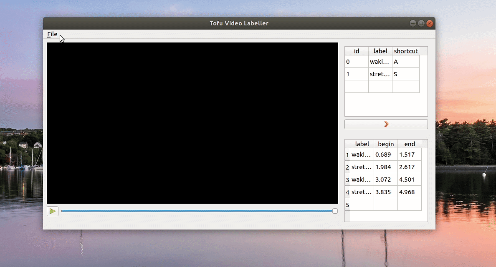

# Tofu - SmartOps Video Labelling Tool

This is a minimalist tool for labelling video clips, e.g. activities, in
the context of Deep Learning applications. So far, it exports
the labelled slices to a *csv* file.

<p align="center">
  
</p>


## Installation

### Ubuntu

If you are planning to play *MP4* or any other proprietary formats, you need
to install the following packages:

``` bash
$ sudo apt install ubuntu-restricted-extras
$ sudo apt install build-essential qt5-default
```

Then, install the required Python Libraries.
It is recommended to create a virtual environment for the application, instead
of installing it globally:

```bash
$ cd <project_dir>
$ python3 -m venv venv
$ source venv/bin/activate
$ pip install -U pip
$ pip install -r requirements.txt
```


### Windows

> TODO: Not tested yet... All contributions are welcome.


## Usage

In order to open the application, go to the project's root path and run the
executable:

```
$ cd <project_dir>
$ ./tofu
```

### Default shortcuts

* Space: Play/Pause
* Arrow Up/Down: speed up/slow down video
* Arrow Right/Left: jump 10 seconds forwads/backwards


### Opening videos

Open a video on **File** menu.


### Creating labels

Add labels and set shortcuts for each one of them.


### Labelling

Press the shortcut when the video is running or paused to label a slice of
the video. It's required to press the shortcut again to mark the end of the
labelled video clip. Labels can overlap each other and those which do not have
the end mark are highlighted on the bottom right table.


### Exporting

After labelling the video, you can export your tags to a csv file.




